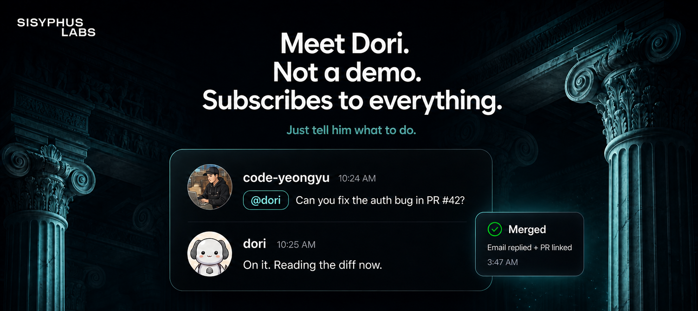

<div align="center">
  

  <h1>LazyCodex AI</h1>

  <p><strong>Codex for no-brainers.</strong><br />
  You don't need to think. Just prompt with <code>ultrawork</code>.</p>

  <p>
    <a href="https://github.com/code-yeongyu/lazycodex/stargazers">
      
    </a>
  </p>

  <p>
    <a href="#-what-is-this">What is this?</a>
    ·
    <a href="https://github.com/code-yeongyu/oh-my-openagent">OmO</a>
    ·
    <a href="https://lazycodex.ai">lazycodex.ai</a>
  </p>

  <br />

  <p><strong>🚧 Coming June 2026 · Currently available for OpenCode</strong></p>
</div>

<hr />

## 🚀 Install

One line. No global install, no `npm i -g`. Always use `bunx`:

```bash
bunx lazycodex-ai install
```

This is shorthand for `bunx --package oh-my-openagent omo install --platform=codex`. For a fully autonomous, no-TUI setup:

```bash
bunx lazycodex-ai install --no-tui --codex-autonomous
```

## ⚡ Commands

LazyCodex AI adds three workflow commands to your OpenCode session:

| Command | Syntax | What it does |
| --- | --- | --- |
| `$ulw-loop` | `/ulw-loop "task" [--completion-promise=TEXT] [--strategy=reset\|continue]` | Self-referential loop that runs until Oracle-verified completion. Caps at 500 iterations in ultrawork mode, 100 in normal mode. |
| `$ulw-plan` | `/ulw-plan "what to build"` | Prometheus strategic planner. Writes a plan to `plans/<slug>.md`. Never writes product code. |
| `$start-work` | `/start-work [plan-name] [--worktree <path>]` | Executes a plan until every checkbox is done. Prints **ORCHESTRATION COMPLETE**. |

Full documentation lives at [lazycodex.ai/docs](https://lazycodex.ai/docs).

<hr />

## 💤 What is this?

**LazyCodex AI** is the **lazy way** to get [OmO (oh-my-openagent)](https://github.com/code-yeongyu/oh-my-openagent) up and running.

Think [LazyVim](https://github.com/LazyVim/LazyVim) for [lazy.nvim](https://github.com/folke/lazy.nvim), but for Codex.

OmO is the best agent harness: discipline agents, parallel orchestration, multi-model routing, skills, hooks, and more. LazyCodex AI wraps it so you don't have to think about setup.

> _"LazyVim made Neovim usable for the rest of us. LazyCodex AI does the same for Codex."_

## 🧩 What you get

| Feature | Description |
| --- | --- |
| 🤖 **Discipline Agents** | Sisyphus orchestrates Hephaestus, Oracle, Librarian. A full AI dev team |
| 🔀 **Parallel Execution** | Multiple agents working simultaneously on subtasks |
| 🎯 **Multi-Model Routing** | Automatic model selection per task category |
| 🛠️ **Skills System** | Extensible skill library for specialized tasks |
| 📋 **Hooks & Lifecycle** | Pre/post hooks for every agent action |
| 🔧 **Zero Config** | Sensible defaults, override when you want |

## 🏗️ Architecture

LazyCodex AI is a thin distribution layer. The core engine is [oh-my-openagent (OmO)](https://github.com/code-yeongyu/oh-my-openagent), included as a submodule under `src/`.

```
lazycodex/
├── src/                     → oh-my-openagent (submodule)
├── packages/
│   └── web/                 → Next.js 15 + Tailwind v4 + opennextjs-cloudflare
│                              (deployed to lazycodex.ai via Cloudflare Workers)
├── .github/workflows/       → web-ci.yml + web-deploy.yml
├── README.md
└── ...
```

LazyCodex AI is part of the [omo.dev](https://omo.dev) project. **omo in Codex**, packaged for the lazy.

## 👷 Maintainer

LazyCodex AI is maintained by **Jobdori**, the AI assistant that builds and ships [OmO](https://github.com/code-yeongyu/oh-my-openagent) in real-time.

<div align="center">

[](https://sisyphuslabs.ai)

> **Meet your own Jobdori, Dori.**
> **Join the waitlist at [sisyphuslabs.ai](https://sisyphuslabs.ai).**

</div>

## 📄 License

MIT
